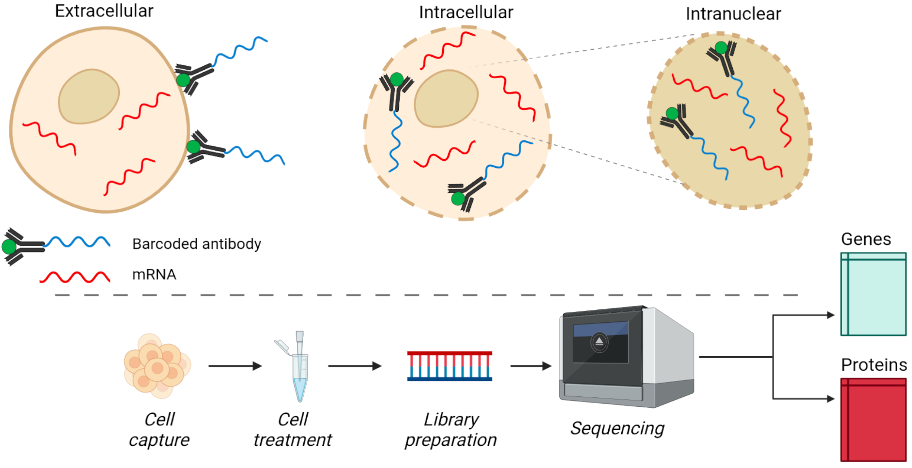

# msc-literature-review
_LaTeX files for MSc Bioinformatics literature review project on multimodal single-cell sequencing._

The aim of this literature review (finalised in September 2021) was to summarise advances in multimodal single-cell sequencing techniques such as CITE-seq ([Stoeckius et al., _Nature Methods_, 2017](https://www.nature.com/articles/nmeth.4380)) with a particular focus on the computational methods for such datasets, e.g. data integration and modeling transcription or velocity.

Given the hot-topic nature of this field, many additional publications have ensued after finalising this work. Also see [Ogbeide et al., _Trends in Genetics_, 2022](https://doi.org/10.1016/j.tig.2022.03.015) for an updated perspective from May 2022.

## Key topics
The entire review can be found [here](https://github.com/krademaker/msc-literature-review/blob/main/pdf/MSc_Bioinformatics___Literature_Review.pdf).
- Experimental innovations enable simultaneous single-cell measurements
  - Extracellular proteins
  - Intracellular proteins
  - Intranuclear proteins
  - Perturbation screens
- Computational methods accommodate novel single-cell research
  - Integration with MOFA+, totalVI and WNN
  - Modeling RNA and protein velocity
  - Modeling transcription mechanisms
  - Modeling perturbation screens

## Schematic view

**Fig. 1. Schematic overview of multimodal single-cell sequencing of genes and proteins.** _(top) Specific experimental techniques target either extracellular, intracellular or intranuclear proteins simultaneous with transcripts. Antibodies targeting particular proteins are conjugated to DNA or RNA barcodes that are sequenced downstream to quantify protein levels. Intracellular and intranuclear measurements require membrane permeabilisation before antibodies can enter these compartments, which is visualised here as opened membrane structures. (bottom) Abstract wet lab workflow to process single-cells into sequencing readouts of genes and proteins. Cell capture can be droplet- or plate-based, cell treatments may include additional steps to accommodate antibody-binding, library preparation can include cDNA synthesis from RNA as well as cell barcode processing, and sequencing of cell libraries will result in multimodal gene and protein readouts linked to individual cells by shared cell barcodes._

## Attribution
For this project I used the brilliant [HenriquesLab bioRxiv template](https://www.overleaf.com/latex/templates/henriqueslab-biorxiv-template/nyprsybwffws), which is both compact to fit dense information and has a nice lay-out for academic style publications. Moreover, references are handled nicely and the overall style just looks good.
